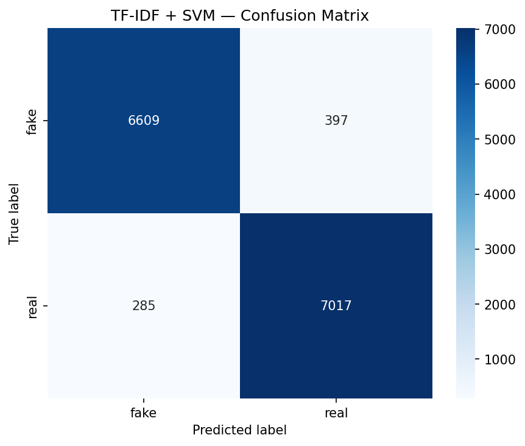
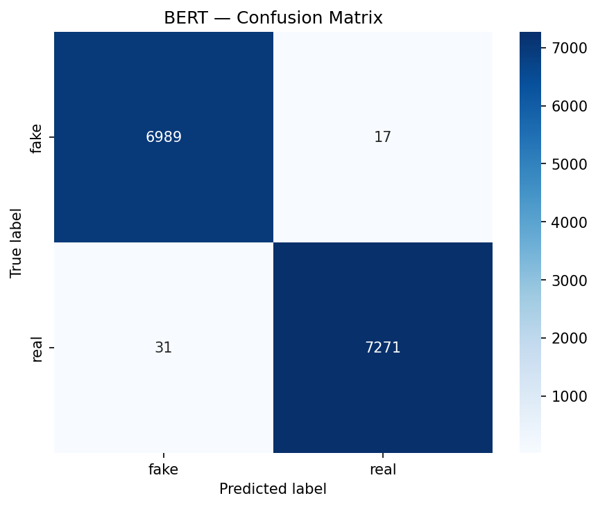
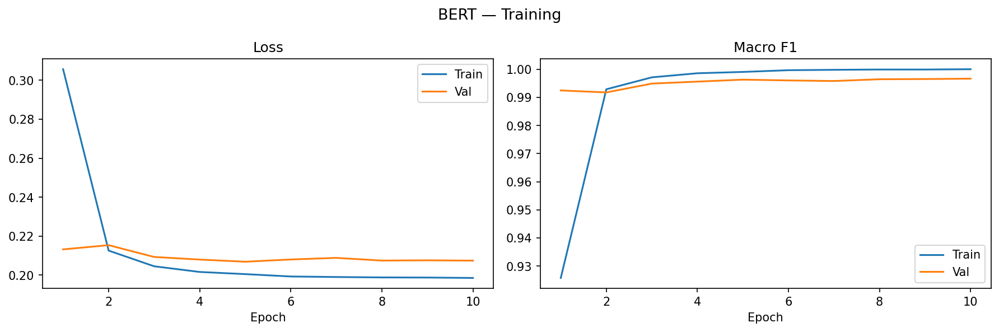
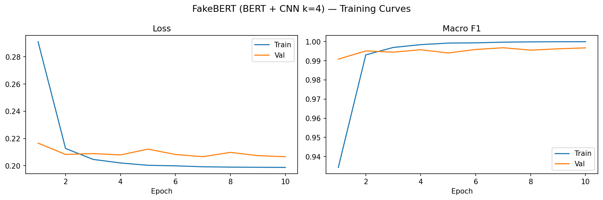
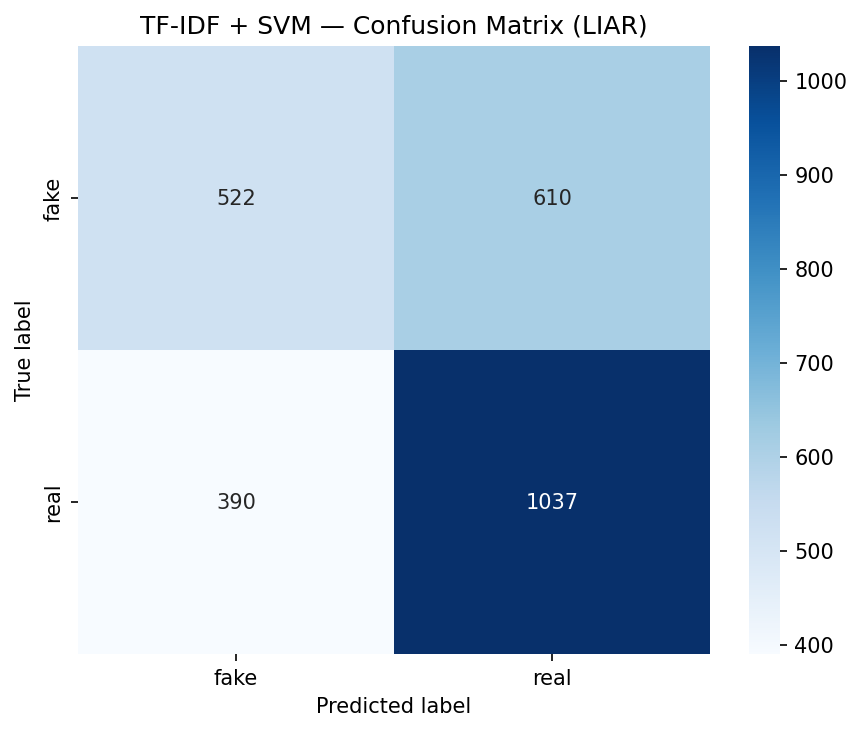
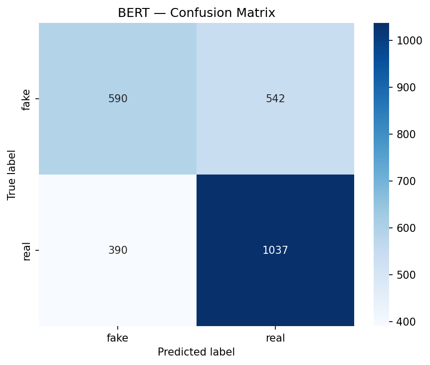
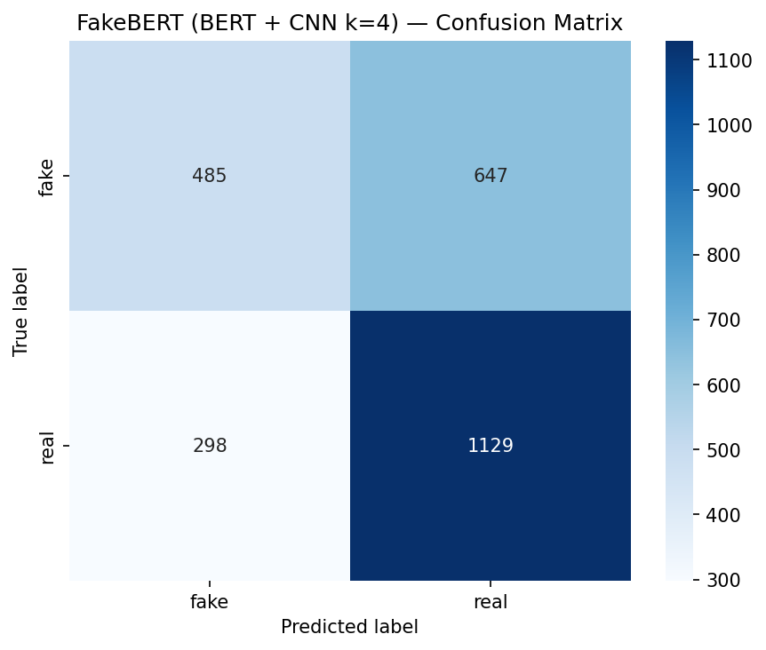
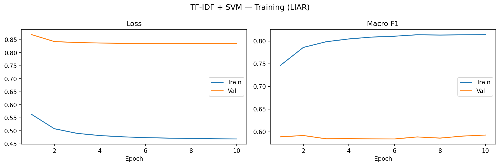
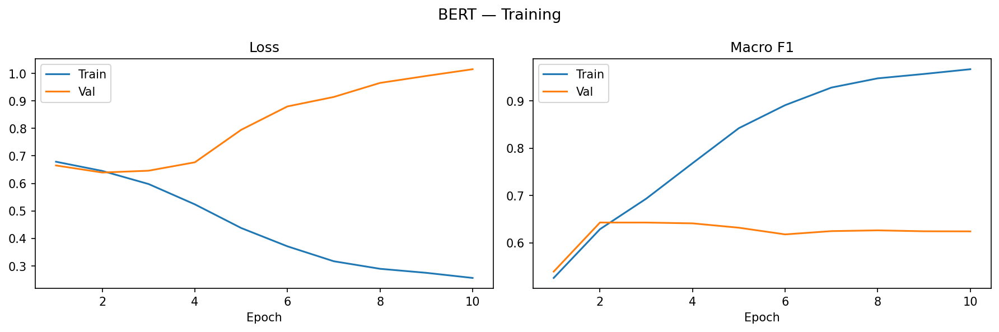
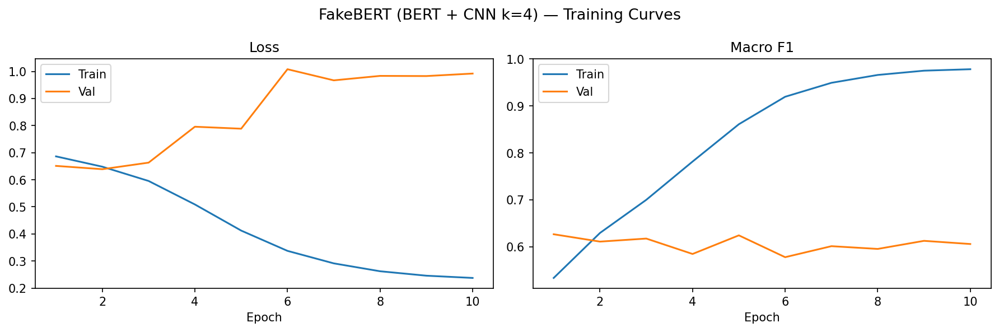

# Section 1: Introduction

The spread of unverified information across socio-economic groups makes fake news detection an increasingly pressing problem. This project implements and compares three text classification approaches — ranging from a classical bag-of-words baseline to fine-tuned transformer models — evaluated across two benchmark datasets.

# Section 2: Literature Review

Recent work has shifted from CNN/LSTM architectures toward transformer-based models, with BERT variants (RoBERTa, DeBERTa, FakeBERT) achieving state-of-the-art results on most benchmarks.

## Transformer-Based Models

Pre-trained transformers capture bidirectional context and can be fine-tuned for fake news classification, though they are computationally expensive at inference time.

| Model     | Key Feature                                                    | Best For                                    |
| :-------- | :------------------------------------------------------------- | :------------------------------------------ |
| BERT      | Baseline transformer, bidirectional context                    | General fake news classification            |
| RoBERTa   | More training data, longer sequences                           | Higher accuracy on nuanced text             |
| DeBERTa   | Disentangled attention (separates content & position)          | Subtle misinformation detection             |
| BERT-FND  | Fine-tuned BERT with explainability tools                      | Interpretable fake news detection           |
| Fake-BERT | BERT + parallel CNN blocks for local n-gram patterns           | High accuracy on ambiguous language         |

## Sequential & Hybrid Models (LSTM, CNN, BiGRU)

Less compute-heavy than transformers, effective on limited data, but struggle with long-range dependencies. CNNs detect local n-gram patterns; LSTMs/GRUs capture sequential structure; hybrids combine both.

## LLMs for Few-Shot & Zero-Shot Detection

GPT-4, LLaMA, and similar models require no fine-tuning but suffer from high latency and hallucinated explanations — making them unsuitable for production fake news detection.

# Section 3: Data

Datasets are accessible via Kaggle mirrors and are compatible with the HuggingFace `datasets` library.

| Dataset                                                                                       | Description                                                                                       |
| :-------------------------------------------------------------------------------------------- | :------------------------------------------------------------------------------------------------ |
| [FakeNewsNet](https://www.kaggle.com/datasets/mdepak/fakenewsnet)                             | PolitiFact + GossipCop articles with social engagement metadata.                                  |
| [PolitiFact Fact Check](https://www.kaggle.com/datasets/rmisra/politifact-fact-check-dataset) | Political statements with 6-level labels.                                                         |
| [GossipCop](https://www.kaggle.com/datasets/akshaynarayananb/gossipcop)                       | Entertainment news fact-checker; useful for sensationalist writing patterns.                      |
| [LIAR](https://www.kaggle.com/datasets/doanquanvietnamca/liar-dataset)                        | PolitiFact statements with 6-class labels and speaker metadata. Self-contained and benchmarked.   |
| [FEVER](https://fever.ai/dataset/fever.html)                                                  | Wikipedia-derived claims; requires evidence retrieval — closer to NLI than classification.        |

# Section 4: Preprocessing

Each model requires different preprocessing; the raw text is never shared as-is across pipelines.

## TF-IDF + SVM

Input text (title + body on WELFake; statement + speaker + context on LIAR) is cleaned and normalised before vectorisation:

1. Non-alphabetic characters stripped via regex
2. Lowercased and tokenised
3. English stopwords removed (NLTK)
4. Porter stemming applied per token
5. Processed tokens joined and passed to `TfidfVectorizer(max_features=10000, ngram_range=(1,2))`

Bigrams are included to capture compound signals such as "breaking news" or "deep state" that carry little weight as unigrams.

## BERT and FakeBERT

No manual preprocessing — the BERT tokenizer handles normalisation, subword splitting, and special token insertion (`[CLS]`, `[SEP]`). Input fields are concatenated with a space separator before tokenisation:

- **WELFake**: `title + " " + text`
- **LIAR**: `statement + " " + speaker + " " + context`

Sequences are truncated to 256 tokens and padded to uniform length per batch. Labels are mapped to integer indices (`fake → 0`, `real → 1`).

# Section 5: Experimental Setup

## Datasets

| Dataset  | Size       | Split     | Label type                              |
| :------- | :--------- | :-------- | :-------------------------------------- |
| WELFake  | ~72k rows  | 80/20     | Binary (0 = fake, 1 = real)             |
| LIAR     | ~12.8k rows | 80/20    | 6-class, binarised (pants-fire/false/barely-true → fake; half-true/mostly-true/true → real) |

Splits are stratified on the label to preserve class distribution. No validation set is held out separately — early stopping is based on the test split (noted as a limitation in the Discussion).

## Evaluation metrics

- **Primary**: Macro F1 — averages F1 across both classes equally, penalising class-imbalanced predictions
- **Secondary**: Accuracy, per-class recall (fake / real separately)
- **Inference**: Wall-clock seconds and samples/sec on the test set (single run, no averaging)

## Hardware

All experiments run on Apple M4 (MPS backend) for transformer models; SVM training is CPU-only. Scripts auto-detect the available device at runtime.

## Hyperparameters

| Parameter     | TF-IDF + SVM        | BERT / FakeBERT                    |
| :------------ | :------------------ | :--------------------------------- |
| Epochs        | 10 (SGD passes)     | 10                                 |
| Batch size    | N/A                 | 16                                 |
| Learning rate | α = 1e-4 (SGD)      | 1e-5 (BERT layers), 1e-4 (CNN/head) |
| Max seq len   | N/A                 | 256 tokens                         |
| Warmup        | N/A                 | 10% of total steps                 |

# Section 6: Architecture

Three architectures of increasing complexity, each representing a distinct NLP paradigm:

## TF-IDF + SVM

`src/TF-IDF_SVM_classifier.py` — Text vectorised with TF-IDF (unigrams + bigrams), classified with a linear SVM. Fast, interpretable via coefficient weights, and establishes the performance baseline.

## BERT

`src/BERT_classifier.py` — Fine-tuned `bert-base-uncased`. Bidirectional attention captures global context across the full input, giving it a structural advantage on longer articles.

| Component       | Detail                               |
| :-------------- | :----------------------------------- |
| Base model      | bert-base-uncased (109M parameters)  |
| Max sequence    | 256 tokens                           |
| Optimiser       | AdamW, lr=1e-5, weight decay=0.01    |
| Schedule        | Linear warmup (10%) + linear decay   |
| Classifier head | Linear(768 → num_classes)            |

## FakeBERT

`src/Fake-BERT_classifier.py` — Extends BERT with a parallel CNN branch. The full token sequence passes through a 4-gram CNN block to capture local patterns (sensationalist phrases, hedging language) that global attention may underweight. The CNN output and `[CLS]` embedding are concatenated before classification.

```
BERT encoder
    ├── [CLS] token  → global context vector  (768d)
    └── all tokens   → CNN(kernel=4) → MaxPool → local pattern vector  (128d)
Concat([CLS], CNN_out) → Dropout → Linear → num_classes
```

| Component       | Detail                                                   |
| :-------------- | :------------------------------------------------------- |
| Base model      | bert-base-uncased                                        |
| CNN kernel      | size 4 (4-gram patterns), 128 filters                    |
| Optimiser       | AdamW — 1e-5 (BERT), 1e-4 (CNN + head)                  |
| Schedule        | Linear warmup (10%) + linear decay                       |
| Classifier head | Linear(768 + 128 → num_classes)                          |

# Section 7: Usage

## Installation

```
git clone https://github.com/ilonae/Fake-News-Detection.git
cd Fake-News-Detection
python -m venv .venv && source .venv/bin/activate
pip install -r requirements.txt
```

## Device support

Scripts automatically detect and use Apple MPS (M-series), CUDA, or CPU.

## Running the models

All scripts download the dataset automatically via `kagglehub` on first run.

```
# TF-IDF + SVM
python src/TF-IDF_SVM_classifier.py
python src/TF-IDF_SVM_classifier.py --plot --epochs 10

# BERT
python src/BERT_classifier.py
python src/BERT_classifier.py --epochs 4 --batch_size 8

# FakeBERT
python src/Fake-BERT_classifier.py
python src/Fake-BERT_classifier.py --epochs 4 --batch_size 8 --num_filters 128
```

## Output

All scripts write to `outputs/`:

```
outputs/
├── ..._confusion_matrix.png
├── ..._training_curves.png
└── bert_finetuned/          # saved weights and tokenizer
```

# Section 8: Results

## WELFake

80/20 stratified split of WELFake (72k articles). Primary metric: macro F1.

| Model        | Accuracy | Macro F1 | Inference time (s) | Samples/sec |
| :----------- | :------- | :------- | :----------------- | :---------- |
| TF-IDF + SVM | 96.14%   | 0.9613   | 127.22             | 112.5       |
| BERT         | 99.56%   | 0.9956   | 301.29             | 47.5        |
| FakeBERT     | 99.49%   | 0.9949   | 305.74             | 46.9        |

### Confusion matrices

<p align="center">
  
  
  
</p>

### Learning curves — BERT vs FakeBERT

<p align="center">
  
  
</p>

## LIAR

80/20 stratified split of LIAR (~10k statements, 6-class labels binarised to fake/real).

| Model        | Accuracy | Val Macro F1 | Fake recall | Real recall |
| :----------- | :------- | :----------- | :---------- | :---------- |
| TF-IDF + SVM | 60.9%    | ~0.59        | 46.1%       | 72.7%       |
| BERT         | 63.6%    | ~0.63        | 52.1%       | 72.7%       |
| FakeBERT     | 63.1%    | ~0.62        | 42.8%       | 79.1%       |

### Confusion matrices

<p align="center">
  
  
  
</p>

### Learning curves — SVM vs BERT vs FakeBERT

<p align="center">
  
  
  
</p>

# Section 9: Discussion

## WELFake

All three models achieve strong results on WELFake, reflecting its clean binary signal.

**Complexity vs. accuracy** — SVM reaches 96.1% F1 at a fraction of the compute cost. Transformer models add no meaningful accuracy gain, but differ in convergence behaviour.

**Convergence** — FakeBERT's CNN branch accelerates early learning by capturing local n-gram patterns before BERT's attention mechanism has fully adapted. The advantage is most visible in epoch 1.

**Inference cost** — SVM processes 112.5 samples/sec vs. ~47 for BERT and FakeBERT, a 2.4× throughput advantage that matters significantly in production.

## LIAR

Performance drops substantially across all models relative to WELFake.

**Dataset difficulty** — LIAR consists of short political statements (~18 tokens avg.) with no sensationalist formatting. The surface cues both TF-IDF and transformers exploit on WELFake are largely absent.

**Label noise** — The 6-class scale is binarised at an arbitrary boundary; `barely-true` and `half-true` statements introduce genuine ambiguity that is not resolvable from text alone.

**Fake recall collapse** — All three models default toward "real": BERT recovers 52% of fake samples, SVM 46%, FakeBERT 43%. FakeBERT's higher real recall (79.1%) comes at the direct cost of its fake recall — the CNN branch amplifies the majority-class bias on short inputs.

**Overfitting vs. plateau** — Both transformer models reach train F1 ~1.0 by epoch 10 while val F1 stalls at ~0.62–0.63 from epoch 2; FakeBERT's val loss diverges more sharply after epoch 5. SVM is stable from epoch 3 but too weak to close the train/val F1 gap. Early stopping at epoch 2–3 is appropriate for both transformer models on LIAR.

## Outlook

Several directions follow naturally from these results:

- **Class balancing** — Weighted cross-entropy or oversampling the fake class would directly address the fake recall gap seen on LIAR across all models.
- **Early stopping** — Val F1 saturates at epoch 2 on LIAR; stopping there would reduce overfitting without architectural changes.
- **Richer LIAR input** — LIAR provides speaker identity, party affiliation, and historical credibility counts. Incorporating these as additional features is a well-established improvement in the LIAR literature and likely the highest-value next step.
- **Stronger baselines** — RoBERTa or DeBERTa as the encoder backbone would raise the ceiling on both datasets with minimal implementation overhead.
- **Cross-dataset generalisation** — Training on WELFake and evaluating on LIAR (zero-shot transfer) would test whether the learned features generalise beyond article-length text, and is the natural follow-up to this cross-dataset comparison.

# Section 10: Conclusion

Three fake news detection approaches were implemented and evaluated on WELFake and LIAR.

On WELFake, all models perform strongly — BERT and FakeBERT reach ~99.5% macro F1, while SVM achieves 96.1% at 2.4× the throughput. The BERT/FakeBERT gap is negligible, suggesting FakeBERT's CNN branch adds little when inputs are long and lexically rich.

On LIAR, performance drops to ~60–64% across all models. The limiting factors are task structure (short statements, no surface cues) and label noise from binarisation — not model capacity. All three models show a systematic fake recall deficit, and both transformer models overfit from epoch 2 onward.

Three takeaways:

1. **Dataset structure dominates model choice** — SVM is competitive with BERT when signal is strong. Model complexity should follow data quality, not precede it.
2. **LIAR requires targeted treatment** — early stopping, class balancing, and speaker metadata are higher-value interventions than swapping the encoder.
3. **FakeBERT's CNN advantage is dataset-conditional** — beneficial in theory for short ambiguous inputs, but in practice amplifies majority-class bias on LIAR and offers no gain on WELFake.

# Section 11: Contributing

Contributions are welcome, especially around additional architectures or dataset integrations.

1. Fork the repo
2. Create a feature branch: `git checkout -b feature/your-feature`
3. Follow conventions: `logging` over `print`, plots to `outputs/`, CLI `--args` for hyperparameters
4. Submit a PR with a brief description

# Section 12: References

- Devlin, J. et al. (2019). *BERT: Pre-training of Deep Bidirectional Transformers for Language Understanding.* NAACL. https://arxiv.org/abs/1810.04805
- Liu, Y. et al. (2019). *RoBERTa: A Robustly Optimized BERT Pretraining Approach.* https://arxiv.org/abs/1907.11692
- Shu, K. et al. (2018). *FakeNewsNet: A Data Repository with News Content, Social Context and Spatiotemporal Information.* https://arxiv.org/abs/1809.01286
- Wang, W. Y. (2017). *"Liar, Liar Pants on Fire": A New Benchmark Dataset for Fake News Detection.* ACL. https://arxiv.org/abs/1705.00648
- Thorne, J. et al. (2018). *FEVER: a Large-scale Dataset for Fact Extraction and VERification.* NAACL. https://arxiv.org/abs/1803.05355
- Rohera, D. et al. (2022). *FakeBERT: Fake News Detection in Social Media with a BERT-based Deep Learning Approach.* Multimedia Tools and Applications. https://doi.org/10.1007/s11042-022-13183-y
